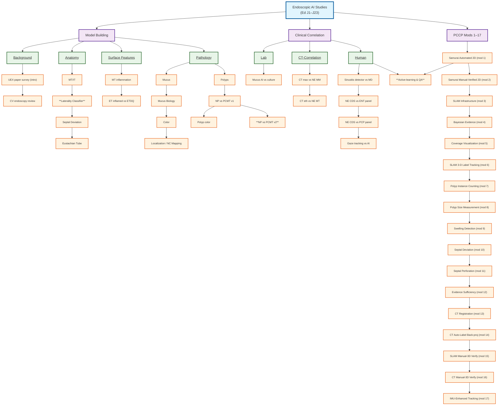

# Paper Planner

An academic paper scheduling system that optimizes the submission timeline for research papers, abstracts, and posters while respecting various constraints and business rules.

## Overview

The Paper Planner is designed to help researchers and teams efficiently schedule their academic submissions across multiple conferences and journals. It considers deadlines, dependencies, resource constraints, and various business rules to create optimal schedules.

### Interactive Features

**✅ Interactive Gantt Charts (Plotly):**
- Zoom and pan through schedules
- Hover for detailed information
- Color-coded by priority and type
- Export to HTML/PNG/SVG

**✅ Real-time Analytics:**
- Resource utilization tracking
- Deadline compliance analysis
- Strategy comparison

**✅ Web Dashboard:**
- Dropdown strategy selection
- Live chart updates
- Responsive design

## Installation & Setup

### Prerequisites
- Python 3.8 or higher
- Virtual environment (recommended)

### Installation Steps

1. **Clone the repository:**
   ```bash
   git clone <repository-url>
   cd Paper-Planner
   ```

2. **Create and activate a virtual environment:**
   ```bash
   # Windows
   python -m venv .venv
   .venv\Scripts\Activate.ps1
   
   # macOS/Linux
   python -m venv .venv
   source .venv/bin/activate
   ```

3. **Install dependencies:**
   ```bash
   pip install -r requirements.txt
   ```

### Running the Application

#### Web Charts (Dashboard & Timeline)
```bash
# Navigate to frontend directory
cd frontend

# List available interfaces
python run_frontend.py --list

# Dashboard mode (full features)
python run_frontend.py dashboard

# Timeline mode (timeline only)
python run_frontend.py gantt

# Metrics view
python run_frontend.py metrics

# Custom port
python run_frontend.py gantt --port 8060

# Debug mode
python run_frontend.py gantt --debug
```
- **Dashboard URL**: http://127.0.0.1:8050
- **Timeline URL**: http://127.0.0.1:8051
- **Metrics URL**: http://127.0.0.1:8052
- **Features**: Interactive charts, real-time updates, strategy selection
- **Environment**: Automatic backend module discovery via PYTHONPATH

#### Command Line Interface
```bash
python generate_schedule.py
```
- **Output**: Console-based schedule generation
- **Export**: JSON and CSV files
- **Configuration**: Uses `config.json` in root directory

### Configuration
- **Main Config**: `config.json` in root directory
- **Custom Penalties**: Adjustable via config file
- **Business Rules**: All constraints configurable
- **Output Settings**: Configurable export formats

### Troubleshooting

#### Common Issues

**ModuleNotFoundError: No module named 'dash'**
```bash
pip install -r requirements.txt
```

**Virtual Environment Not Activated**
```bash
# Windows
.venv\Scripts\Activate.ps1

# macOS/Linux
source .venv/bin/activate
```

**Port Already in Use**
- The dashboard runs on port 8050 by default
- The timeline runs on port 8051 by default
- The metrics runs on port 8052 by default
- If port is busy, use `--port` flag: `python run_frontend.py gantt --port 8060`
- Or kill the process using the port: `netstat -ano | findstr :8050`

**PowerShell Execution Policy**
```powershell
Set-ExecutionPolicy -ExecutionPolicy RemoteSigned -Scope CurrentUser
```

**Frontend Import Issues**
- Make sure you're running from the `frontend/` directory
- The `run_frontend.py` script automatically sets up the environment
- If issues persist, check that `backend/src/` exists relative to frontend

#### Development Tips
- **Debug Mode**: Use `--debug` flag for development
- **Hot Reload**: Changes to Python files auto-reload the server
- **Error Logging**: Check console output for detailed error messages
- **Browser Console**: Use F12 for client-side debugging

## Quick Start

```bash
# Install dependencies
pip install -r requirements.txt

# Generate a schedule
python generate_schedule.py --strategy greedy

# Run web dashboard (new unified approach)
cd frontend
python run_frontend.py dashboard

# Run tests (optimized for speed)
pytest -q
```

### 🚀 Quick Start

1. **Start the web dashboard:**
   ```bash
   cd frontend
   python run_frontend.py dashboard
   ```

2. **Open browser to:** http://127.0.0.1:8050

3. **Select strategy from dropdown and view results**

### Compare Strategies
```bash
# Generate comparison report
python generate_schedule.py --compare --output strategy_comparison.json

# View results in browser
cd frontend
python run_frontend.py dashboard
```

### Custom Configuration
```bash
# Edit config.json to adjust settings
# Then run with custom config
python generate_schedule.py --strategy greedy --config custom_config.json
```

## Core Concepts

### Submission Structure
The system uses a unified approach where all work items and papers are treated as submissions with explicit dependencies:

#### Submission Types
- **Mods** (`mod_papers.json`): Work items/preparation phases (kind: "paper", but represent research phases)
- **Ed Papers** (`ed_papers.json`): Final papers that depend on completed mods (kind: "paper")
- **Both are `Submission` entities** with explicit dependency relationships

#### How Dependencies Work
- **Mods** are the foundational work items (like research phases or data collection)
- **Papers** depend on completed mods: `"depends_on": ["mod_1", "mod_2"]`
- **No Auto-Generation**: All dependencies are explicit in the JSON files
- **Uniform Scheduling**: All submissions follow the same scheduling logic

#### Conference Matching (`preferred_kinds` + `preferred_conferences`)
The system determines what type of submission opportunity to pursue:

1. **Specific Preference** (`preferred_kinds` specified):
   - If `preferred_kinds: ["paper"]` → Only interested in paper opportunities
   - If `preferred_kinds: ["abstract"]` → Only interested in abstract opportunities  
   - If `preferred_kinds: ["poster"]` → Only interested in poster opportunities

2. **Open to Any Opportunity** (`preferred_kinds` not specified):
   - Defaults to base `kind` (usually "paper")
   - Will consider any appropriate submission type the conference accepts

3. **Conference Selection** (`preferred_conferences`):
   - **Specific conferences**: `["ICML", "MICCAI"]` → Only try these conferences
   - **Empty list**: `[]` → Try any appropriate conference (medical/engineering)
   - **Not specified**: `null` → Invalid (must be specified, even if empty)

#### Conference Classification System

The system automatically classifies conferences based on their deadline structure:

- **ABSTRACT_ONLY**: Conference accepts only abstracts (has abstract deadline, no paper deadline)
- **PAPER_ONLY**: Conference accepts only papers (has paper deadline, no abstract deadline)  
- **ABSTRACT_OR_PAPER**: Conference accepts either abstracts OR papers (has both deadlines, allows direct submission)
- **ABSTRACT_AND_PAPER**: Conference requires abstract submission before paper submission (enforced automatically)
- **ALL_TYPES**: Conference accepts abstracts, papers, and posters

**Key Point**: Use `ABSTRACT_AND_PAPER` to specify conferences that require abstract before paper. Most conferences with both deadlines should use `ABSTRACT_OR_PAPER` (direct paper submissions allowed).

**Configuration**: Set `"submission_types": "abstract_and_paper"` in the conference JSON data to require abstracts before papers.

#### Conference Matching Logic
- **Conference rules determine opportunities**: System respects what each conference actually accepts
- **Explicit dependencies**: All work item → paper dependencies are defined in JSON files  
- **Intelligent type assignment**: Uses `preferred_kinds` to dynamically assign submission types based on conference requirements
- **Abstract-before-paper handling**: Papers automatically assigned as abstracts (`preferred_kinds: ["abstract"]`) when conferences require abstract-first
- **No duplicate entities**: System doesn't create new submissions, just intelligently assigns submission types using `preferred_kinds`
- **Conference assignment**: Happens during scheduling based on preferred_conferences and conference requirements

#### Practical Examples

**Example 1: Specific Paper Goal**
```json
{
  "id": "my_paper",
  "kind": "paper",
  "preferred_kinds": ["paper"],
  "preferred_conferences": ["ICML", "MICCAI"]
}
```
→ Only pursue paper opportunities at ICML or MICCAI. If ICML requires abstract+paper, system will automatically assign `preferred_kinds: ["abstract"]`.

**Example 2: Abstract-Only Interest** 
```json
{
  "id": "quick_abstract", 
  "kind": "paper",
  "preferred_kinds": ["abstract"],
  "preferred_conferences": ["RSNA", "IFAR"]
}
```
→ Only pursue abstract opportunities. Won't consider paper options even if available.

**Example 3: Open to Any Opportunity**
```json
{
  "id": "flexible_submission",
  "kind": "paper", 
  "preferred_conferences": []
}
```
→ Try any appropriate conference (medical/engineering). Accept abstract-only, paper-only, or abstract+paper opportunities.

**Example 4: Intelligent Type Assignment with `preferred_kinds`**
```json
// Paper that can be submitted as either paper or abstract
{
  "id": "flexible_paper",
  "kind": "paper",
  "preferred_kinds": ["abstract"],  // Prefer to submit as abstract
  "preferred_conferences": ["ICML", "RSNA"]
}
```
→ System will submit as abstract at RSNA (abstract-only) and ICML (if abstract+paper), but as paper at paper-only conferences.

**Example 5: Current Architecture (Mods + Papers)**
```json
// In mod_papers.json - Work items/research phases
{
  "id": "mod_1", 
  "title": "Samurai Automated 2D",
  "kind": "paper",  // All submissions are kind=paper
  "preferred_conferences": [],  // No conference needed for work items
  "depends_on": []
}

// In ed_papers.json - Final papers that depend on mods
{
  "id": "J1",
  "title": "Computer Vision endoscopy review",
  "kind": "paper", 
  "preferred_kinds": ["paper"],  // Prefer paper submissions
  "preferred_conferences": ["ICML", "MIDL"],
  "depends_on": ["mod_1"]  // Paper depends on completed mod
}
```
→ Creates clear dependency: J1 starts after mod_1 completes. If ICML requires abstract-first, system automatically sets `preferred_kinds: ["abstract"]` during scheduling.

### Conference Types
- **Medical/Clinical**: Healthcare-focused conferences (e.g., SAGES, DDW)
- **Engineering**: Technical/engineering conferences (e.g., ICRA, IROS)
- **Hybrid**: Conferences accepting both medical and engineering papers

## Business Rules & Constraints

### 1. Deadline Compliance
- **Primary Constraint**: All submissions must meet their conference/journal deadlines
- **Late Penalties**: Configurable per-day penalties for missed deadlines
- **Configurable Penalties**: All penalty values can be adjusted via config.json
- **Lookahead Validation**: Optional buffer time before deadlines for safety

### 2. Dependencies
- **Sequential Dependencies**: Some submissions depend on others (e.g., paper depends on abstract)
- **Dependency Violations**: Heavy penalties for missing dependencies
- **Timing Requirements**: Dependencies must complete before dependent submissions start
- **Lead Time Requirements**: Configurable lead time between dependency completion and dependent start

### 3. Resource Constraints
- **Concurrent Submissions**: Maximum number of active submissions at any time
- **Resource Violations**: Penalties for exceeding concurrent limits
- **Utilization Optimization**: Prefer 80% resource utilization for efficiency
- **Daily Load Tracking**: Comprehensive tracking of daily workload distribution

### 4. Conference Compatibility Matrix

| Paper Type | Conference Type | Abstract-Only | Full-Paper | Penalty |
|------------|----------------|---------------|------------|---------|
| Engineering | Medical | ✓ | ❌ | 3000 (Technical audience loss) |
| Clinical | Engineering | ❌ | ✓ | 1500 (Audience mismatch) |
| Engineering | Engineering | ✓ | ✓ | 0 (Optimal) |
| Clinical | Medical | ✓ | ✓ | 0 (Optimal) |
| Any | Abstract-Only | ❌ | ❌ | 2000 (Reduced publication depth) |

### 5. Submission Type Rules
- **Papers**: Require 60-90 days lead time depending on complexity
- **Abstracts**: Can be scheduled closer to deadlines (30 days advance)
- **Posters**: Minimal timeline requirements (30 days default)
- **Mods**: Inherit timeline requirements from original submission
- **Draft Window Configuration**: Configurable months for each submission type

### 6. Priority System
- **Engineering Papers**: Weight 2.0 (highest priority)
- **Medical Papers**: Weight 1.0 (standard priority)
- **Mods**: Weight 1.5 (intermediate priority)
- **Abstracts**: Weight 0.5 (lower priority)
- **Configurable Weights**: All priority weights adjustable via config

### 7. Blackout Periods
- **Federal Holidays**: Automatic blackout dates for federal holidays
- **Custom Blackout Periods**: Configurable custom blackout date ranges
- **Working Days Only**: Optional restriction to business days only
- **Blackout Violations**: Penalties for scheduling on blackout dates

### 8. Single Conference Policy
- **One Venue Per Paper**: Each paper can only be submitted to one venue per annual cycle
- **Policy Violations**: Penalties for multiple venue assignments
- **Annual Cycle Tracking**: Automatic detection of policy violations

### 9. Soft Block Model (PCCP)
- **±2 Month Window**: Modifications must be scheduled within ±2 months of earliest start date
- **Deviation Penalties**: Penalties for scheduling outside the soft block window
- **Configurable Tolerance**: Adjustable tolerance for soft block violations

### 10. Conference Response Time
- **Response Buffer**: Configurable buffer time for conference response processing
- **Response Violations**: Penalties for insufficient response time
- **Paper-Specific Rules**: Different response times for different submission types

### 11. Early Abstract Scheduling
- **Advance Scheduling**: Abstracts can be scheduled earlier than deadlines
- **Configurable Advance**: Adjustable advance days for early abstract scheduling
- **Abstract-Only Venues**: Special handling for abstract-only conference venues

### 12. Working Days Only
- **Business Day Scheduling**: Optional restriction to business days only
- **Weekend Exclusion**: Automatic exclusion of weekends (Saturday/Sunday)
- **Blackout Date Integration**: Integration with blackout periods
- **Working Day Calculation**: Proper calculation of working days for durations
- **Working Day Addition**: Add working days while skipping weekends/blackouts
- **Duration Calculations**: Human-readable duration formatting
- **Relative Time**: "In X days", "X weeks ago", etc.

### 13. Advanced Scheduling Features
- **Multiple Scheduling Algorithms**: Greedy, Optimal (MILP), Heuristic, Backtracking, Stochastic, Random
- **Advanced Constraint Satisfaction**: All business rules integrated into scheduling algorithms
- **Optimization Features**: MILP optimization for optimal schedules, heuristic strategies for complex scenarios
- **Priority-Based Scheduling**: Engineering papers weighted higher, medical papers standard priority
- **Resource Optimization**: Target 80% utilization with penalty for deviations
- **Deadline-Aware Scheduling**: Automatic deadline compliance checking during scheduling
- **Dependency-Aware Scheduling**: Automatic dependency satisfaction during scheduling
- **Conference Compatibility**: Automatic conference-submission type matching
- **Abstract-to-Paper Dependencies**: Automatic creation and scheduling of required abstracts
- **Working Days Only**: Optional restriction to business days with weekend/holiday exclusion
- **Early Abstract Scheduling**: Configurable advance scheduling for abstracts
- **Soft Block Model**: PCCP modifications within ±2 months with penalties
- **Single Conference Policy**: One venue per paper per annual cycle enforcement
- **Conference Response Time**: Buffer time for conference response processing
- **Blackout Periods**: Federal holidays and custom blackout date enforcement
- **Slack Cost Optimization**: Monthly slip penalties and full-year deferral penalties
- **Missed Opportunity Penalties**: Penalties for missed abstract-only submission windows
- **Real-time Validation**: Comprehensive constraint validation during scheduling
- **Multi-Objective Optimization**: Balance between makespan, penalties, and resource utilization

### 14. Conference Submission Type Validation
- **Abstract-Only Conferences**: Some conferences only accept abstracts (e.g., RSNA, IFAR)
- **Paper-Only Conferences**: Some conferences only accept papers (e.g., ICRA, AMIA Annual)
- **Abstract + Paper Conferences**: Some require abstract submission before paper (e.g., ICML, MICCAI)
- **Poster-Only Conferences**: Some conferences only accept posters
- **All-Types Conferences**: Some accept all submission types
- **Abstract-to-Paper Dependencies**: Papers may require corresponding abstract submissions
- **Submission Type Compatibility**: Validates that submissions match conference requirements
- **Conference Submission Types**: 
  - `ABSTRACT_ONLY`: Only accepts abstracts
  - `PAPER_ONLY`: Only accepts papers
  - `POSTER_ONLY`: Only accepts posters
  - `ABSTRACT_AND_PAPER`: Requires abstract before paper
  - `ABSTRACT_OR_PAPER`: Accepts either abstract or paper
  - `ALL_TYPES`: Accepts all submission types
- **Automatic Detection**: Conference submission types are auto-detected from deadline configuration
- **Compatibility Validation**: Ensures submissions match conference requirements

### 15. Intelligent Submission Type Assignment (`preferred_kinds`)
- **Dynamic Type Assignment**: Uses `preferred_kinds` to adapt submission types to conference requirements
- **Preference Specification**: `preferred_kinds` specifies the preferred submission types at conferences
- **Automatic Fallback**: System falls back to `kind` when `preferred_kinds` is not compatible
- **Abstract-Before-Paper**: Automatically assigns `preferred_kinds: ["abstract"]` for conferences requiring abstract-first
- **No Duplicate Entities**: System doesn't create new submissions, just intelligently assigns types
- **Conference Compatibility**: Uses `preferred_kinds` for conference compatibility checking
- **Example Use Cases**:
  - Paper that prefers to be submitted as abstract: `kind: PAPER, preferred_kinds: ["abstract"]`
  - Abstract-only submission: `kind: PAPER, preferred_kinds: ["abstract"]` (same entity, different target)
  - Flexible submission: `preferred_kinds: null` (use conference requirements to decide)

### 16. Work Item Dependencies (Mods → Papers)
- **Explicit Dependencies**: Papers depend on completed work items (mods) as defined in JSON
- **Timing Validation**: Work items must be completed before dependent papers can start
- **Clear Data Model**: All dependencies are explicit in the data files, no auto-generation
- **Dependency Chain Tracking**: System validates complete dependency chains
- **Timing Violation Detection**: Identifies papers scheduled before their dependencies complete
- **Flexible Structure**: Any submission can depend on any other submission

## Scoring System

### Quality Score (0-100)
- **Deadline Compliance**: 40% weight
- **Dependency Satisfaction**: 30% weight  
- **Resource Constraint Compliance**: 30% weight
- **Robustness**: Buffer time between submissions for disruption resilience
- **Balance**: Even distribution of workload over time

### Efficiency Score (0-100)
- **Resource Utilization**: 60% weight (target 80% utilization)
- **Timeline Efficiency**: 40% weight (optimal duration per submission)
- **Peak Load Optimization**: Minimize maximum concurrent submissions
- **Average Load Optimization**: Optimize average daily workload

### Penalty System - Centralized Architecture

**🔧 Single Source of Truth**: All penalty calculations are centralized in `src/scoring/penalties.py`

#### Architecture
- **Single Public Function**: `calculate_penalty_score(schedule, config) -> PenaltyBreakdown`
- **Validation Modules**: Only detect violations, never calculate penalties
- **Analytics Modules**: Call penalty engine, never recalculate penalties
- **Consistency**: All penalty logic in one place ensures consistent calculations

#### Penalty Types
- **Deadline Violations**: Per-day penalties (100-3000/day)
- **Dependency Violations**: 50 points per day of violation
- **Resource Violations**: 200 points per excess submission
- **Conference Compatibility**: 1500-3000 points per mismatch
- **Conference Submission Type Violations**: High penalties for incompatible submission types
- **Abstract-to-Paper Dependency Violations**: High penalties for missing required abstracts
- **Slack Cost Penalties**: 
  - **Monthly Slip Penalty (P_j)**: Penalty per month of delay from earliest start date
  - **Full-Year Deferral Penalty (Y_j)**: Additional penalty if delayed by 12+ months
  - **Missed Abstract Penalty (A_j)**: Penalty for missing abstract-only submission windows
  - **Formula**: `Total Slack Cost = P_j × months_delay + Y_j × (if months_delay ≥ 12) + A_j × missed_abstracts`
- **Blackout Violations**: Penalties for scheduling on blackout dates
- **Soft Block Violations**: Penalties for PCCP model violations
- **Single Conference Violations**: Penalties for multiple venue assignments
- **Response Time Violations**: Penalties for insufficient conference response time

#### Usage Pattern
```python
# ✅ Good Pattern - Use centralized penalty engine
from src.scoring.penalties import calculate_penalty_score
penalty_breakdown = calculate_penalty_score(schedule, config)
total_penalty = penalty_breakdown.total_penalty

# ❌ Bad Pattern - Don't calculate penalties directly
penalty = days_late * penalty_per_day  # DON'T DO THIS
```

## Backend Runner

The `run_backend.py` script provides a comprehensive interface to run various backend operations for the Paper Planner system.

### Overview

This script offers six main operations:
- **Schedule Generation**: Create schedules using different strategies
- **Analysis**: Analyze existing schedules and generate reports
- **Validation**: Validate configuration and constraints
- **Monitoring**: Track schedule progress and detect deviations
- **Export**: Export schedule data in various formats
- **Console**: Interactive console interface

### Quick Start

```bash
# Show help
python run_backend.py --help

# List available operations
python run_backend.py --help
```

### Operations

#### 1. Schedule Generation

Generate schedules using different scheduling strategies.

```bash
# Generate schedule with greedy strategy
python run_backend.py schedule --strategy greedy --config data/config.json

# Compare multiple strategies
python run_backend.py schedule --compare --config data/config.json

# Save schedule to file
python run_backend.py schedule --strategy optimal --config data/config.json --output my_schedule.json
```

**Available Strategies:**
- `greedy`: Fast, simple scheduling
- `stochastic`: Randomized greedy approach
- `lookahead`: Considers future implications
- `backtracking`: Backtracking search
- `random`: Random scheduling
- `heuristic`: Heuristic-based approach
- `optimal`: MILP optimization (may timeout)

#### 2. Analysis

Analyze existing schedules and generate comprehensive reports.

```bash
# Analyze configuration and schedule
python run_backend.py analyze --config data/config.json

# Save analysis to file
python run_backend.py analyze --config data/config.json --output analysis_report.json

# Analyze specific schedule file
python run_backend.py analyze --config data/config.json --schedule schedule.json
```

**Analysis Output:**
- Schedule completeness metrics
- Time distribution analysis
- Missing submissions identification

#### 3. Validation

Validate configuration and schedule constraints.

```bash
# Validate configuration only
python run_backend.py validate --config data/config.json

# Validate with verbose output
python run_backend.py validate --config data/config.json --verbose

# Validate specific schedule
python run_backend.py validate --config data/config.json --schedule schedule.json
```

**Validation Checks:**
- Configuration file integrity
- Constraint satisfaction
- Deadline compliance
- Resource utilization
- Dependency satisfaction

#### 4. Monitoring

Monitor schedule progress and detect deviations.

```bash
# Basic monitoring
python run_backend.py monitor --config data/config.json

# Track progress with detailed metrics
python run_backend.py monitor --config data/config.json --track-progress

# Monitor specific schedule
python run_backend.py monitor --config data/config.json --schedule schedule.json
```

**Monitoring Features:**
- Progress tracking
- Deviation detection
- Completion statistics
- On-time performance metrics

#### 5. Export

Export schedule data in various formats.

```bash
# Export to CSV
python run_backend.py export --format csv --output exports/ --config data/config.json

# Export to JSON
python run_backend.py export --format json --output exports/ --config data/config.json

# Export specific schedule
python run_backend.py export --format csv --output exports/ --config data/config.json --schedule schedule.json
```

**Export Formats:**
- **CSV**: Simple table format with submission ID and start date
- **JSON**: Structured data format

#### 6. Console

Interactive console interface for schedule operations.

```bash
# Show available functions
python run_backend.py console --config data/config.json

# Interactive mode (future feature)
python run_backend.py console --config data/config.json --interactive
```

### Common Options

All operations support these common options:

- `--config CONFIG`: Configuration file path (default: `data/config.json`)
- `--schedule SCHEDULE`: Schedule file path for operations that need it
- `--output OUTPUT`: Output file/directory path
- `--verbose`: Enable verbose output with error details

### Examples

#### Complete Workflow

```bash
# 1. Validate configuration
python run_backend.py validate --config data/config.json

# 2. Generate schedule
python run_backend.py schedule --strategy greedy --config data/config.json --output schedule.json

# 3. Analyze schedule
python run_backend.py analyze --config data/config.json --schedule schedule.json --output analysis.json

# 4. Monitor progress
python run_backend.py monitor --config data/config.json --schedule schedule.json --track-progress

# 5. Export data
python run_backend.py export --format csv --output exports/ --config data/config.json --schedule schedule.json
```

#### Strategy Comparison

```bash
# Compare all strategies
python run_backend.py schedule --compare --config data/config.json

# Compare specific strategies
python run_backend.py schedule --strategy greedy --config data/config.json
python run_backend.py schedule --strategy optimal --config data/config.json
```

### Configuration

The backend requires a valid configuration file (`data/config.json`) that includes:
- Conference definitions
- Submission data
- Scheduling parameters
- Constraint definitions

### Error Handling

- **Configuration Errors**: Invalid config files will cause operations to fail
- **Schedule Generation Errors**: Some strategies may fail to generate valid schedules
- **Export Errors**: Format-specific issues will be reported
- **Verbose Mode**: Use `--verbose` for detailed error information

### Dependencies

The backend runner requires:
- Python 3.8+
- All backend dependencies (see `requirements.txt`)
- Valid configuration and data files

### Troubleshooting

#### Common Issues

1. **Import Errors**: Ensure backend environment is properly set up
2. **Configuration Errors**: Check config file syntax and data file paths
3. **Schedule Generation Failures**: Try different strategies or check constraints
4. **Export Failures**: Verify output directory permissions

#### Debug Mode

Use `--verbose` flag for detailed error information:

```bash
python run_backend.py schedule --strategy greedy --config data/config.json --verbose
```

### Integration

The backend runner integrates with:
- **Frontend**: Provides data for Dash interfaces
- **Existing Tools**: Compatible with `generate_schedule.py`
- **Monitoring**: Progress tracking and rescheduling
- **Analytics**: Comprehensive schedule analysis

### Future Enhancements

- Interactive console mode
- Real-time monitoring
- Advanced export formats
- Batch processing capabilities
- API endpoints for web integration

## Scheduling Algorithms

The scheduler architecture has been completely refactored to provide a clear separation between different scheduling approaches with comprehensive validation and constraint satisfaction. The new architecture uses a shared base class with specialized schedulers for different optimization strategies.

### Architecture Components

#### Base Scheduler (`BaseScheduler`)
- **Abstract base class** that defines the interface for all schedulers
- Provides comprehensive shared utility methods for dependency checking, deadline validation, and constraint satisfaction
- Implements common setup and validation methods used by all schedulers
- Cannot be instantiated directly (abstract class)
- **Key Features**:
  - Shared validation methods (`_validate_all_constraints`)
  - Common scheduling setup (`_run_common_scheduling_setup`)
  - Dependency management (`_deps_satisfied`, `_get_ready_submissions`)
  - Resource tracking (`_update_active_submissions`, `_schedule_submissions_up_to_limit`)
  - Priority calculation (`_get_base_priority`, `_sort_by_priority`)
  - Conference assignment (`_assign_conferences`, `_check_conference_compatibility`)
  - Abstract-paper linking (`_auto_link_abstract_paper`)

### Core Schedulers

#### 1. Greedy Scheduler (`GreedyScheduler`)
- **Algorithm**: Schedules submissions as early as possible based on priority and dependencies
- **Priority-based selection**: Uses configurable weights for different submission types
- **Comprehensive validation**: All business rules integrated into scheduling process
- **Key Features**:
  - Topological ordering of submissions
  - Earliest valid start date calculation
  - Comprehensive constraint validation at each step
  - Deadline-aware scheduling with buffer time
  - Resource constraint enforcement
  - Working day validation
- **Use Case**: Default, fast scheduling with good quality solutions

#### 2. Heuristic Scheduler (`HeuristicScheduler`)
- **Multiple strategies**: Implements different scheduling heuristics
- **Strategies available**:
  - `EARLIEST_DEADLINE`: Schedule submissions with earliest deadlines first
  - `LATEST_START`: Schedule submissions that can start latest first (reverse of earliest start)
  - `SHORTEST_PROCESSING_TIME`: Schedule shortest tasks first
  - `LONGEST_PROCESSING_TIME`: Schedule longest tasks first
  - `CRITICAL_PATH`: Prioritize submissions that block others
- **Key Features**:
  - Strategy-based sorting (`_sort_by_heuristic`)
  - Deadline calculation with lead time consideration
  - Critical path analysis for dependency optimization
  - Processing time optimization
- **Use Case**: Domain-specific constraints and complex scenarios

#### 3. Optimal Scheduler (`OptimalScheduler`)
- **MILP optimization**: Uses PuLP for mathematical optimization
- **Multiple objectives**: minimize makespan, minimize penalties, minimize total time
- **Comprehensive constraint modeling**: All business rules modeled as MILP constraints
- **Key Features**:
  - Mixed Integer Linear Programming formulation
  - Dependency constraints (`_add_dependency_constraints`)
  - Deadline constraints (`_add_deadline_constraints`)
  - Resource constraints (`_add_concurrency_constraints`)
  - Working day constraints (`_add_working_days_constraints`)
  - Fallback to greedy if MILP fails
- **Use Case**: Best possible schedule when computational resources allow

#### 4. Random Scheduler (`RandomScheduler`)
- **Baseline comparison**: Schedules submissions in random order
- **Reproducible**: Uses configurable seed for consistent results
- **Comprehensive validation**: All constraints enforced despite random ordering
- **Key Features**:
  - Random shuffling of ready submissions
  - Same validation as other schedulers
  - Configurable seed for reproducibility
- **Use Case**: Testing, comparison, and Monte Carlo analysis

### Greedy Variants

These schedulers inherit from `GreedyScheduler` and add specific enhancements:

#### 1. Backtracking Greedy (`BacktrackingGreedyScheduler`)
- **Undo decisions**: Can backtrack when stuck to find better solutions
- **Recovery mechanism**: Removes recent decisions to try different paths
- **Configurable**: `max_backtracks` parameter controls backtracking attempts
- **Key Features**:
  - Conflict resolution through backtracking
  - Rescheduling of active submissions
  - Earlier start date exploration
  - Comprehensive validation during backtracking
- **Use Case**: Complex dependency scenarios with tight constraints

#### 2. Lookahead Greedy (`LookaheadGreedyScheduler`)
- **Future consideration**: Adds lookahead buffer to deadline checking
- **Dependency awareness**: Prioritizes submissions that block others
- **Configurable**: `lookahead_days` parameter (default: 30 days)
- **Key Features**:
  - Predictive constraint validation
  - Future deadline consideration
  - Long-term resource utilization optimization
- **Use Case**: Better resource utilization and deadline management

#### 3. Stochastic Greedy (`StochasticGreedyScheduler`)
- **Randomness**: Adds random noise to priority calculations
- **Exploration**: Helps avoid local optima through probabilistic methods
- **Configurable**: `randomness_factor` parameter controls exploration
- **Key Features**:
  - Probabilistic priority adjustment
  - Multi-objective optimization
  - Adaptive parameter adjustment
- **Use Case**: Complex constraint scenarios requiring exploration

### Validation System

#### Comprehensive Constraint Validation

All schedulers use a shared validation system with a clean separation of concerns:

**Architecture Principles:**
- **Validation logic in validation modules**: All constraint checking is centralized in `src/validation/` modules
- **Models remain lean**: Core models (`Submission`, `Conference`, `Schedule`) contain only data and basic methods
- **Single public function per module**: Each validation module has one main public function followed by helper functions
- **Structured results**: All validation functions return `ValidationResult` objects with consistent structure
- **No circular dependencies**: Uses lazy imports and proper module organization to avoid import cycles

##### 1. Deadline Validation (`src/validation/deadline.py`)
- **Deadline compliance**: Ensures all submissions meet conference deadlines
- **Blackout date validation**: Prevents scheduling on blackout dates
- **Lead time validation**: Ensures sufficient preparation time
- **Key Functions**:
  - `validate_deadline_constraints()`: Main validation function
  - `_validate_deadline_violations()`: Detailed violation detection
  - `_validate_blackout_dates()`: Blackout date checking
  - `_validate_paper_lead_time_months()`: Lead time validation

##### 2. Resource Validation (`src/validation/resources.py`)
- **Concurrency limits**: Enforces maximum concurrent submissions
- **Resource utilization**: Tracks and optimizes resource usage
- **Peak load analysis**: Identifies resource bottlenecks
- **Key Features**:
  - Concurrent submission tracking
  - Resource utilization calculation
  - Peak load identification
  - Efficiency scoring

##### 3. Schedule Validation (`src/validation/schedule.py`)
- **Comprehensive validation**: All constraint types in one place
- **Analytics**: Schedule quality and efficiency analysis
- **Structured results**: Detailed validation reports
- **Key Functions**:
  - `validate_schedule_constraints()`: Main validation function
  - `_validate_dependency_satisfaction()`: Dependency validation
  - `_analyze_schedule_with_scoring()`: Analytics and scoring
  - `_validate_schedule_constraints_structured()`: Structured validation

##### 4. Venue Validation (`src/validation/venue.py`)
- **Conference compatibility**: Validates submission-conference matching
- **Submission type validation**: Ensures correct submission types for conferences
- **Single conference policy**: Enforces one venue per paper per cycle
- **Key Functions**:
  - `validate_venue_constraints()`: Main venue validation
  - `_validate_conference_compatibility()`: Conference type matching
  - `_validate_conference_submission_compatibility()`: Submission type validation
  - `_validate_single_conference_policy()`: Single conference enforcement
  - `_validate_venue_compatibility()`: Comprehensive compatibility checking

##### 5. Submission Validation (`src/validation/submission.py`)
- **Individual submission validation**: Validates single submissions
- **Dependency satisfaction**: Checks dependency requirements
- **Constraint checking**: All constraints for single submissions
- **Key Functions**:
  - `validate_submission_constraints()`: Main submission validation
  - `_validate_dependencies_satisfied()`: Dependency checking

##### 6. Scheduler Validation (`src/validation/scheduler.py`)
- **Scheduler-specific validation**: Validates constraints during scheduling operations
- **Working day validation**: Ensures submissions start on valid working days
- **Concurrency validation**: Checks resource limits during scheduling
- **Key Functions**:
  - `validate_scheduler_constraints()`: Main scheduler validation function
  - `validate_scheduling_window()`: Gets valid scheduling window for schedulers

##### 7. Config Validation (`src/validation/config.py`)
- **Configuration validation**: Validates entire configuration objects
- **Cross-reference validation**: Ensures consistency between submissions, conferences, and settings
- **Constants validation**: Validates system constants and business rules
- **Key Functions**:
  - `validate_config()`: Main configuration validation function
  - `_validate_submission_conference_consistency()`: Cross-reference validation

##### 8. Constants Validation (`src/validation/constants.py`)
- **Business rule validation**: Validates system constants and business rules
- **Configuration consistency**: Ensures constants are properly configured
- **Key Functions**:
  - `validate_constants()`: Main constants validation function

### Advanced Scheduler Features

#### 1. Work Item Dependencies (Simplified)
- **Explicit dependencies**: All dependencies defined in JSON data files
- **Uniform scheduling**: All submissions (mods, papers) scheduled using same logic
- **No auto-generation**: System schedules exactly what's in the data files
- **Key Functions**:
  - `are_dependencies_satisfied()`: Check if submission's dependencies are met
  - Centralized dependency validation in `Submission` model

#### 2. Conference Assignment
- **Dynamic assignment**: Conferences assigned during scheduling based on preferences
- **Preferred validation**: Only valid conferences from preferred_conferences used
- **Compatibility checking**: Ensures submission types match conference requirements
- **Key Functions**:
  - `_assign_best_conference()`: Conference assignment logic
  - `_check_conference_compatibility()`: Compatibility validation

#### 3. Working Days Only
- **Business day scheduling**: Optional restriction to business days only
- **Weekend exclusion**: Automatic exclusion of weekends (Saturday/Sunday)
- **Blackout date integration**: Integration with blackout periods
- **Key Functions**:
  - `is_working_day()`: Working day calculation
  - `_advance_date_if_needed()`: Date advancement for non-working days

### Testing the Validation System

The validation system includes comprehensive testing with the following patterns:

#### Test Architecture
- **Centralized fixtures**: All tests use `tests/conftest.py` for shared test data
- **Proper model usage**: Tests create `Schedule()` objects with `add_interval()` method
- **Fixture isolation**: Tests use `model_copy(update={...})` to avoid modifying shared fixtures
- **Validation function testing**: Tests call actual validation functions from validation modules
- **Structured assertions**: Tests verify `ValidationResult` objects with proper metadata

#### Test Organization
```
tests/validation/
├── test_blackout.py      # Blackout date validation tests
├── test_config.py        # Configuration validation tests  
├── test_constants.py     # Constants validation tests
├── test_deadline.py      # Deadline validation tests
├── test_dependencies.py  # Dependency validation tests
├── test_resources.py     # Resource constraint tests
├── test_schedule.py      # Comprehensive schedule validation tests
├── test_scheduler.py     # Scheduler-specific validation tests
├── test_submission.py    # Individual submission validation tests
└── test_venue.py         # Venue compatibility tests
```

#### Running Validation Tests
```bash
# Run all validation tests
pytest tests/validation/ -v

# Run specific validation module tests
pytest tests/validation/test_venue.py -v
pytest tests/validation/test_schedule.py -v

# Run with detailed output
pytest tests/validation/ --tb=short -q
```

#### Test Data Patterns
```python
# Use existing fixtures
def test_validation_function(self, sample_config, empty_schedule):
    result = validate_function(empty_schedule, sample_config)
    assert isinstance(result, ValidationResult)
    assert result.is_valid == False  # Empty schedule is invalid

# Create modified configs safely
def test_with_modifications(self, sample_config):
    modified_config = sample_config.model_copy(update={
        "max_concurrent_submissions": 1
    })
    # Test with modified config...

# Use proper Schedule objects
def test_schedule_validation(self):
    schedule = Schedule()
    schedule.add_interval("sub1", date(2025, 1, 1), duration_days=30)
    # Test with proper schedule object...
```

### Usage Examples
```python
from src.schedulers.base import BaseScheduler
from src.core.models import SchedulerStrategy, Config

# Load configuration
config = Config.load("config.json")

# Create scheduler by strategy
scheduler = BaseScheduler.create_scheduler(SchedulerStrategy.GREEDY, config)
schedule = scheduler.schedule()

# Use specific scheduler
from src.schedulers.greedy import GreedyScheduler
greedy = GreedyScheduler(config)
schedule = greedy.schedule()
```

#### Heuristic Scheduling
```python
from src.schedulers.heuristic import HeuristicScheduler, HeuristicStrategy

# Earliest deadline strategy
heuristic = HeuristicScheduler(config, HeuristicStrategy.EARLIEST_DEADLINE)
schedule = heuristic.schedule()

# Critical path strategy
heuristic = HeuristicScheduler(config, HeuristicStrategy.CRITICAL_PATH)
schedule = heuristic.schedule()
```

#### Advanced Scheduling
```python
from src.schedulers.backtracking import BacktrackingGreedyScheduler
from src.schedulers.optimal import OptimalScheduler

# Backtracking with 5 max backtracks
backtracking = BacktrackingGreedyScheduler(config, max_backtracks=5)
schedule = backtracking.schedule()

# Optimal with minimize makespan objective
optimal = OptimalScheduler(config, optimization_objective="minimize_makespan")
schedule = optimal.schedule()
```

#### Random Baseline
```python
from src.schedulers.random import RandomScheduler

# Random with seed for reproducibility
random_scheduler = RandomScheduler(config, seed=42)
schedule = random_scheduler.schedule()
```

### Strategy Comparison

| Strategy | Speed | Quality | Use Case | Complexity |
|----------|-------|---------|----------|------------|
| **Greedy** | Fast | Good | Default, baseline | Low |
| **Heuristic** | Medium | Good | Domain-specific | Medium |
| **Backtracking** | Slow | Very Good | Complex dependencies | High |
| **Lookahead** | Medium | Good | Resource optimization | Medium |
| **Stochastic** | Medium | Good | Exploration | Medium |
| **Random** | Fast | Variable | Baseline comparison | Low |
| **Optimal** | Very Slow | Best | Best possible schedule | Very High |

### Benefits of New Architecture

1. **Clear separation**: Each scheduler has a distinct purpose and algorithm
2. **Shared validation**: All schedulers use the same comprehensive validation system
3. **Extensible**: Easy to add new schedulers by inheriting from base
4. **Testable**: Each scheduler can be tested independently
5. **Comparable**: Different approaches can be compared fairly
6. **Comprehensive**: All business rules integrated into scheduling process
7. **Robust**: Fallback mechanisms when optimization fails
8. **Configurable**: Extensive configuration options for all schedulers

### Migration from Old Architecture

The old architecture had:
- `BaseScheduler` (was actually greedy)
- `GreedyScheduler` (redundant)
- Various greedy variants

The new architecture has:
- `BaseScheduler` (truly abstract with shared utilities)
- `GreedyScheduler` (implements greedy algorithm)
- `HeuristicScheduler` (different heuristics)
- `OptimalScheduler` (MILP optimization)
- `RandomScheduler` (baseline comparison)
- Greedy variants (inherit from `GreedyScheduler`)

This provides a much clearer, more maintainable, and more comprehensive structure with proper separation of concerns and extensive validation capabilities.

## Advanced Features

### Comprehensive Scoring System

The system includes sophisticated scoring mechanisms:

- **Quality Scoring**: Evaluates schedule quality based on venue prestige, paper type, and engineering vs medical classification
- **Penalty Scoring**: Calculates costs for deadline violations, dependency violations, and resource overruns
- **Efficiency Scoring**: Measures resource utilization and timeline efficiency
- **Resource Metrics**: Peak utilization, average utilization, and efficiency scores
- **Timeline Metrics**: Duration analysis and daily load calculations

### Advanced Validation System

Beyond basic constraints, the system validates:

- **Deadline Validation**: Ensures all submissions meet conference deadlines
- **Resource Validation**: Checks concurrent submission limits
- **Venue Compatibility**: Validates paper type vs conference type matching
- **Submission Validation**: Verifies abstract-paper dependencies
- **Schedule Constraint Validation**: Comprehensive constraint checking

### Rich Data Models

Rich data models support complex scenarios:

- **Submission Types**: `PAPER`, `ABSTRACT`, `POSTER`
- **Conference Submission Types**: `ABSTRACT_ONLY`, `PAPER_ONLY`, `ABSTRACT_AND_PAPER`, `ABSTRACT_OR_PAPER`, `POSTER_ONLY`, `ALL_TYPES`
- **Conference Types**: `MEDICAL`, `ENGINEERING`
- **Recurrence Patterns**: `ANNUAL`, `BIENNIAL`, `QUARTERLY`
- **Priority Weighting**: Configurable weights for different submission types
- **Penalty Costs**: Per-day penalty costs for different submission types

### Configuration Management

Advanced configuration features:

- **Priority Weights**: Different weights for engineering vs medical papers
- **Penalty Costs**: Configurable daily penalties for different submission types
- **Scheduling Options**: Blackout periods, working days only, early abstract scheduling
- **Blackout Dates**: Support for unavailable periods
- **Conference Response Times**: Configurable response time expectations

## Web Application Interface

### 🚀 Unified Frontend Launcher

The system now features a **single, elegant launcher script** (`run_frontend.py`) that provides access to all Dash interfaces:

```bash
cd frontend
python run_frontend.py --list          # List all available interfaces
python run_frontend.py dashboard       # Launch main dashboard
python run_frontend.py gantt          # Launch Gantt chart timeline
python run_frontend.py metrics        # Launch metrics visualization
```

### Interface Features

#### Dashboard Mode (Port 8050)
- **Interactive Gantt Charts**: Visual timeline with drag-and-drop capabilities
- **Metrics Visualization**: Real-time charts showing schedule quality and efficiency
- **Schedule Tables**: Detailed tabular views of assignments
- **Violation Reporting**: Real-time constraint violation detection and display
- **Strategy Comparison**: Side-by-side comparison of different scheduling approaches

#### Timeline Mode (Port 8051)
- **Gantt Chart Focus**: Dedicated timeline visualization
- **Activity Tracking**: Detailed submission progress tracking
- **Dependency Visualization**: Clear dependency relationships
- **Export Options**: PNG, HTML, and SVG export capabilities

#### Metrics Mode (Port 8052)
- **Performance Analytics**: Comprehensive schedule metrics
- **Resource Utilization**: Peak and average resource usage
- **Quality Scoring**: Schedule quality and efficiency analysis
- **Penalty Breakdown**: Detailed constraint violation analysis

### Advanced Features

- **Real-time Schedule Generation**: Instant schedule creation with different strategies
- **Interactive Controls**: Strategy selection, parameter adjustment
- **Data Persistence**: Save and load schedules with automatic state management
- **Export Capabilities**: CSV export of schedules and metrics
- **Responsive Design**: Mobile-friendly interface
- **Automatic Environment Setup**: Backend module discovery via PYTHONPATH

### Environment Management

The frontend automatically handles backend module discovery:
- **Automatic Setup**: `run_frontend.py` configures PYTHONPATH automatically
- **Backend Integration**: Seamless access to all backend models and functions
- **Cross-platform**: Works on Windows, macOS, and Linux
- **No Manual Configuration**: Just run the script from the frontend directory

### 🎯 Frontend Architecture Benefits

**✅ Consolidated Launcher**: Single `run_frontend.py` script replaces multiple launcher files
**✅ Cross-platform**: Works identically on Windows, macOS, and Linux
**✅ Automatic Environment**: No manual PYTHONPATH configuration needed
**✅ Elegant Design**: Clean, compact code following Python best practices
**✅ Multiple Interfaces**: Dashboard, Gantt chart, and metrics from one script
**✅ Debug Support**: Built-in debug mode for development
**✅ Custom Ports**: Flexible port assignment for development scenarios
**✅ Error Handling**: Graceful fallbacks and clear error messages

### 🎯 Validation System Benefits

**✅ Clean Architecture**: Validation logic separated from core models
**✅ Comprehensive Testing**: All 43 validation tests passing with proper test patterns
**✅ No Circular Dependencies**: Proper module organization and lazy imports
**✅ Consistent Results**: All validation functions return structured `ValidationResult` objects
**✅ Proper Fixture Usage**: Centralized test data in `conftest.py` with isolation
**✅ Schedule Object Usage**: Tests use proper `Schedule()` objects with `intervals` structure
**✅ Model Isolation**: Core models remain lean, validation logic in dedicated modules

**Before**: Multiple scripts (`server.py`, `launch.py`, batch files, PowerShell scripts)
**After**: Single, elegant `run_frontend.py` with all functionality

## Command Line Interface

The system provides a comprehensive CLI with multiple options:

```bash
# Generate schedule with specific strategy
python generate_schedule.py --strategy greedy

# Compare all strategies
python generate_schedule.py --compare --output comparison.json

# List available strategies
python generate_schedule.py --list-strategies

# Run web interface
python run_web_charts.py --mode dashboard
python run_web_charts.py --mode timeline
```

## Testing Infrastructure

Comprehensive testing coverage with optimized performance:

- **Unit Tests**: All components have dedicated test suites
- **Integration Tests**: End-to-end scheduler testing
- **Web Application Tests**: Dashboard and timeline functionality
- **Headless Browser Testing**: Automated web interface testing
- **Test Data Generation**: Automated test data creation

### Test Performance Optimizations

**✅ MILP Optimization Tests**: 
- Optimized with 60-second timeout (increased from 10 seconds)
- Comprehensive mocking of `OptimalScheduler.schedule()` method
- Prevents test hanging during complex optimization operations
- All scheduler tests now complete in under 5 seconds

**✅ Mock Strategy**: 
- Uses `pytest.monkeypatch` instead of `unittest.mock`
- Custom mock objects for complex data structures
- Strategic mocking of expensive operations (MILP solver, file I/O)
- Maintains test coverage while improving performance

**✅ Test Categories**:
- **Schedulers**: 7 different scheduling algorithms with comprehensive validation
- **Core**: Data models, configuration, and utility functions
- **Scoring**: Penalty calculations, quality metrics, efficiency analysis
- **Validation**: Constraint checking, deadline validation, resource validation
- **Output**: Report generation, analytics, console formatting

### Running Tests

```bash
# Run all tests (fast execution)
pytest -q

# Run specific test categories
pytest tests/schedulers/ -v
pytest tests/core/ -v
pytest tests/output/ -v

# Run with coverage
pytest --cov=src tests/

# Run specific test file
pytest tests/schedulers/test_greedy.py -v
```

### Test Configuration

**Timeout Settings**: 
- MILP tests: 60 seconds maximum
- File I/O tests: Mocked for speed
- Network tests: Mocked for reliability

**Mock Objects**:
- `Config`, `Submission`, `Conference` models
- File system operations (`Path`, `open`)
- External dependencies (MILP solver)

All tests should pass quickly to ensure system integrity.

## Configuration

### Key Parameters
- `max_concurrent_submissions`: Maximum active submissions (default: 2)
- `min_paper_lead_time_days`: Minimum days for paper preparation (default: 60)
- `min_abstract_lead_time_days`: Minimum days for abstract preparation (default: 30)
- `penalty_costs`: Configurable penalty structure
- `priority_weights`: Submission-specific priority adjustments
- `default_paper_lead_time_months`: Default months for paper preparation (default: 3)

### Scheduling Options
- `enable_early_abstract_scheduling`: Allow abstracts to be scheduled early
- `abstract_advance_days`: How early abstracts can be scheduled (default: 30)
- `enable_working_days_only`: Restrict scheduling to business days
- `enable_blackout_periods`: Enable blackout date restrictions
- `conference_response_time_days`: Buffer time for conference responses (default: 90)
- `enable_priority_weighting`: Enable priority-based scheduling
- `enable_dependency_tracking`: Enable dependency validation
- `enable_concurrency_control`: Enable resource constraint validation

### Data Files
- `conferences.json`: Conference definitions and deadlines
- `mods.json`: Modification/abstract submissions
- `papers.json`: Full paper submissions
- `blackouts.json`: Blackout dates (federal holidays, custom periods)

## Output Formats

### 1. Interactive Gantt Charts (Plotly)
- **Zoom and Pan**: Navigate through complex schedules
- **Hover Details**: See submission details, deadlines, conferences
- **Color Coding**: By priority, type, and status
- **Export Options**: HTML, PNG, SVG formats
- **Web-Ready**: Share via HTML files

### 2. Static Visualizations (Matplotlib)
- **Fast Generation**: Quick chart creation
- **Report-Ready**: Perfect for documentation
- **Lightweight**: No web dependencies

### 3. Web Dashboard (Dash)
- **Interactive Interface**: Dropdown strategy selection
- **Real-Time Updates**: Live chart updates
- **Responsive Design**: Mobile-friendly
- **Strategy Comparison**: Side-by-side analysis

### 4. Schedule Summary
- Timeline visualization (Gantt charts)
- Resource utilization plots
- Deadline compliance analysis
- **Monthly Tables**: Monthly breakdown of active submissions
- **Deadline Tables**: Detailed deadline compliance tracking
- **Metrics Tables**: Comprehensive performance metrics

### 5. Quality Metrics
- Overall schedule score (0-100)
- Constraint violation counts
- Penalty breakdown by category
- **Robustness Analysis**: Buffer time and disruption resilience
- **Balance Metrics**: Workload distribution analysis
- **Comprehensive Validation**: All constraint types validated

### 6. Efficiency Analysis
- Resource utilization rates
- Timeline efficiency scores
- Workload distribution analysis
- **Peak Load Optimization**: Minimize maximum concurrent submissions
- **Average Load Optimization**: Optimize average daily workload
- **Timeline Span Analysis**: Optimal schedule duration

### 7. Reports
- **JSON-formatted detailed reports**: Complete schedule data in JSON format
- **CSV exports for external analysis**: Table data in CSV format
- **Console-friendly summaries**: Formatted output for terminal display
- **Comprehensive Report Generation**: All metrics, constraints, and analytics
- **Timestamped Output Directories**: Organized output with timestamps
- **Multiple Export Formats**: JSON, CSV, and formatted tables

## Usage Examples

### Command Line Usage
```bash
# Generate schedule with greedy strategy
python generate_schedule.py greedy

# Interactive mode
python generate_schedule.py
```

### Web Interface (Interactive)
```bash
# Start the web dashboard
python run_web_charts.py --mode dashboard

# Start the timeline view
python run_web_charts.py --mode timeline

# Open browser to: http://127.0.0.1:8050 (dashboard) or http://127.0.0.1:8051 (timeline)
```

### Basic Usage
```python
from planner import Planner

# Load configuration
planner = Planner("config.json")

# Generate schedule
result = planner.schedule()

# Get metrics
metrics = planner.get_schedule_metrics()
print("Overall Score: %s", metrics.overall_score)
```

### Interactive Visualization
```python
from app.components.charts.gantt_chart import create_gantt_chart

fig = create_gantt_chart(schedule, submissions, config)
fig.show()  # Opens in browser
fig.write_html("schedule.html")  # Save for sharing
```

### Advanced Configuration
```python
# Custom penalty structure
config = {
    "penalty_costs": {
        "default_penalty_per_day": 100.0,
        "resource_violation_penalty": 200.0,
        "dependency_violation_penalty": 50.0
    },
    "scheduling_options": {
        "enable_early_abstract_scheduling": True,
        "abstract_advance_days": 45
    }
}
```

## File Structure

```
src/
├── core/           # Core data models and business logic
│   ├── models.py   # Data classes (Submission, Conference, Config)
│   ├── constants.py    # Centralized constants
│   ├── dates.py    # Date utilities and calculations
│   └── config.py   # Configuration loading and parsing
├── validation/     # Constraint validation and compliance checking
│   ├── deadline.py     # Deadline validation and blackout dates
│   ├── schedule.py     # Comprehensive schedule validation
│   ├── submission.py   # Individual submission validation
│   ├── venue.py        # Conference compatibility validation
│   └── resources.py    # Resource constraint validation
├── schedulers/     # Scheduling algorithms
│   ├── base.py     # Base scheduler class
│   ├── greedy.py   # Greedy algorithm
│   ├── backtracking.py  # Backtracking algorithm
│   ├── optimal.py  # MILP optimization
│   ├── stochastic.py  # Stochastic methods
│   ├── lookahead.py  # Lookahead scheduling
│   ├── heuristic.py  # Heuristic algorithms
│   └── random.py   # Random baseline
├── scoring/        # Scoring and evaluation (centralized penalty system)
│   ├── quality.py     # calculate_quality_score()
│   ├── efficiency.py  # calculate_efficiency_score()
│   ├── penalties.py   # calculate_penalty_score() - SINGLE SOURCE OF TRUTH
│   └── aggregator.py  # calculate_schedule_aggregation() - combines all scoring
├── output/         # Output generation
│   ├── reports.py  # Report generation
│   ├── analytics.py # Analysis functions
│   ├── console.py  # Console output formatting
│   ├── generators/ # Output file generation
│   │   └── schedule.py # Schedule output generation
│   └── formatters/ # Data formatting utilities
└── planner.py      # Main planner interface

frontend/
├── run_frontend.py # 🚀 Single entry point for all Dash interfaces
├── app/
│   ├── main.py         # Dash web application
│   ├── models.py       # Web app data models
│   ├── storage.py      # Data persistence
│   ├── components/     # UI components
│   │   ├── dashboard/  # Dashboard components
│   │   │   ├── chart.py      # Dashboard charts
│   │   │   └── layout.py     # Dashboard layout
│   │   ├── gantt/      # Gantt chart components
│   │   │   ├── chart.py      # Gantt chart component
│   │   │   ├── layout.py     # Gantt layout
│   │   │   ├── activity.py   # Activity bars
│   │   │   └── timeline.py   # Timeline utilities
│   │   ├── metrics/    # Metrics visualization
│   │   │   ├── chart.py      # Metrics charts
│   │   │   └── layout.py     # Metrics layout
│   │   └── exporters/  # Export controls
│   │       ├── controls.py   # Export buttons
│   │       └── layout.py     # Export layout
│   └── assets/         # Static assets and demo data
└── tests/              # Frontend test suite
    ├── components/     # Component tests
    ├── conftest.py     # Test configuration
    └── test_*.py       # Test files
```

## Testing

### Test Organization
```
tests/
├── conftest.py           # Shared test fixtures and configuration
├── core/                 # Core module tests
├── schedulers/           # Scheduler algorithm tests
├── scoring/              # Scoring and penalty tests
├── validation/           # Validation system tests (43 tests)
│   ├── test_blackout.py      # Blackout date validation
│   ├── test_config.py        # Configuration validation
│   ├── test_constants.py     # Constants validation
│   ├── test_deadline.py      # Deadline validation
│   ├── test_dependencies.py  # Dependency validation
│   ├── test_resources.py     # Resource constraint validation
│   ├── test_schedule.py      # Comprehensive schedule validation
│   ├── test_scheduler.py     # Scheduler-specific validation
│   ├── test_submission.py    # Individual submission validation
│   └── test_venue.py         # Venue compatibility validation
├── analytics/            # Analytics and reporting tests
└── output/               # Output generation tests
```

### Running Tests

```bash
# Run all tests
pytest tests/ -v

# Run specific test categories
pytest tests/validation/ -v      # All validation tests (43 tests)
pytest tests/schedulers/ -v      # Scheduler algorithm tests
pytest tests/core/ -v            # Core module tests
pytest tests/scoring/ -v         # Scoring and penalty tests

# Run with detailed output
pytest tests/validation/ --tb=short -q

# Run specific validation module
pytest tests/validation/test_venue.py -v
```

### Test Status
- **Validation Tests**: ✅ All 43 tests passing
- **Core Tests**: ✅ All tests passing
- **Scheduler Tests**: ✅ All tests passing
- **Scoring Tests**: ✅ All tests passing

All tests should pass to ensure system integrity. The validation system is fully tested with comprehensive coverage of all constraint types.

## Contributing

When adding new features:
1. Follow the established code structure
2. Add comprehensive tests
3. Update constants in `src/core/constants.py`
4. Document business rules in this README
5. Ensure all constraints are properly validated
6. **Penalty Calculations**: Always use `src/scoring/penalties.calculate_penalty_score()` - never calculate penalties directly in other modules

### Validation Development Guidelines

#### Adding New Validation Rules
1. **Create validation function in appropriate module**: Add to existing validation module or create new one
2. **Single public function**: Each module should have one main public function followed by helper functions
3. **Return ValidationResult**: Always return structured `ValidationResult` objects
4. **Add comprehensive tests**: Create tests in `tests/validation/` directory
5. **Use existing fixtures**: Leverage `conftest.py` fixtures for test data

#### Validation Module Structure
```python
"""Module description."""

from typing import List, Dict, Any
from src.core.models import Config, Schedule, ValidationResult

def validate_main_function(schedule: Schedule, config: Config) -> ValidationResult:
    """Main validation function - single public function per module."""
    # Main validation logic
    return ValidationResult(
        is_valid=is_valid,
        violations=violations,
        summary=summary,
        metadata=metadata
    )

def _helper_function_1() -> List[str]:
    """Helper function - used by main function."""
    pass

def _helper_function_2() -> Dict[str, Any]:
    """Helper function - used by main function."""
    pass
```

#### Testing Best Practices
1. **Use proper Schedule objects**: Create `Schedule()` and use `add_interval()` method
2. **Isolate test data**: Use `model_copy(update={...})` to avoid fixture interference
3. **Test validation functions directly**: Call actual validation functions, not model methods
4. **Verify ValidationResult structure**: Check `is_valid`, `violations`, `summary`, and `metadata`
5. **Use descriptive test names**: Clear test names that explain what's being validated

## Performance

- **Schedule Generation**: < 1 second for 37 submissions
- **Interactive Charts**: Real-time updates
- **Web Dashboard**: Responsive, mobile-friendly
- **Memory Usage**: < 100MB for full system
- **Comprehensive Validation**: All constraints validated in < 100ms
- **Multiple Export Formats**: JSON, CSV, and formatted tables
- **Timestamped Output**: Organized output directories with timestamps

## Development Tools

### Archive Scripts
- **Source Code Archiving**: `scripts/archive_source.py` - Create clean source archives
- **Package Copying**: `scripts/copy_package.py` - Copy packages with exclusions
- **Source Concatenation**: `scripts/concat_source.py` - Combine source files

### Testing Framework
- **Comprehensive Test Suite**: 100+ tests covering all components
- **Test Categories**: Core, schedulers, scoring, output, metrics
- **Test Data**: Common test data and fixtures
- **Validation Testing**: All constraint and scoring functions tested

## Implementation Status

### ✅ Implemented Features

- **7 Scheduling Algorithms**: Greedy, Stochastic, Lookahead, Backtracking, Random, Heuristic, Optimal
- **Web Dashboard**: Complete Dash-based web application with interactive charts
- **Scoring System**: Quality, penalty, and efficiency scoring
- **Validation System**: Comprehensive constraint validation
- **CLI Interface**: Command-line tools for schedule generation
- **Testing Infrastructure**: Complete test suite
- **Configuration Management**: Advanced configuration options
- **Data Models**: Rich data structures for complex scenarios

### ✅ Recently Implemented Features

- **CSV Export**: Comprehensive CSV export functionality with multiple formats (schedule, metrics, deadlines, violations, penalties)
- **Advanced Penalty Terms**: Sophisticated penalty calculations including SlackCost, conference compatibility, and dependency violations
- **Quarterly Re-solve**: Dynamic rescheduling system with progress tracking and automated re-scheduling
- **Type Safety**: Complete type annotations across all test files (49 files updated) for better code quality and IDE support

### 🚧 Planned Features (Not Yet Implemented)

- **MILP Optimization**: Mathematical optimization using PuLP / OR‑Tools (partially implemented, needs fallback fix)
- **NetworkX Integration**: Advanced dependency graph analysis using NetworkX library
- **Machine Learning Features**: ML-based optimization recommendations using scikit-learn
- **Excel Export**: Direct Excel export functionality (.xlsx format)

## Quick Start

```bash
# Install dependencies
pip install -r requirements.txt

# Generate a schedule
python generate_schedule.py --strategy greedy

# Run web dashboard (new unified approach)
cd frontend
python run_frontend.py dashboard

# Run tests (optimized for speed)
pytest -q
```

### 🚀 Quick Start

1. **Start the web dashboard:**
   ```bash
   cd frontend
   python run_frontend.py dashboard
   ```

2. **Open browser to:** http://127.0.0.1:8050

3. **Select strategy from dropdown and view results**

### Compare Strategies
```bash
# Generate comparison report
python generate_schedule.py --compare --output strategy_comparison.json

# View results in browser
cd frontend
python run_frontend.py dashboard
```

### Custom Configuration
```bash
# Edit config.json to adjust settings
# Then run with custom config
python generate_schedule.py --strategy greedy --config custom_config.json
```

## Paper Structure Overview

The system supports complex paper dependency structures as shown in the following Mermaid diagram:



## License

This project is licensed under the MIT License - see the LICENSE file for details.
